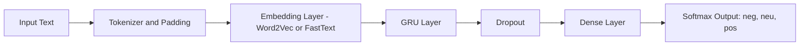

# CENG442 – NLP project (Part‑2)  
## Azerbaijani YouTube Dataset + Word2Vec/FastText + GRU (Domain Analysis)

---

## 1) Goal and Scope

In Part‑2 you will build a practical **Azerbaijani-language sentiment analysis pipeline** by combining:

1) **Part‑1 instructor-provided labeled datasets** (the datasets you previously had to **merge** for training; continuity is mandatory), and  
2) A new **unlabeled** dataset you will collect from **YouTube comments** written in **Azerbaijani**, grouped into **5 domains**.

A strict requirement is that YouTube comments **must not be mixed with Turkish**. Therefore, you must implement and use an **Azerbaijani-only filter** based on Azerbaijani-specific characters and linguistic markers.

You will train and evaluate a **GRU-based sentiment classifier** using **your Part‑1 Word2Vec and FastText embeddings**.

---

## 2) Domains (5 categories)

You will organize YouTube videos (and their comments) into exactly these five domains (**use these names verbatim**):

1. **Technology & Digital Services**  
2. **Finance & Business**  
3. **Social Life & Entertainment**  
4. **Retail & Lifestyle**  
5. **Public Services**

### Recommended scale
- At least **20 videos per domain**
- At least **10,000 Azerbaijani-filtered comments per domain**

---

## 3) Finding Domain-Relevant Videos on YouTube (Using Metadata)

You may use YouTube Data API or a manual discovery step (YouTube search UI) + API fetch.

### 3.1 Domain keyword pools (examples in Azerbaijani)
Use Azerbaijani keywords to find relevant videos.

- **Technology & Digital Services:** `telefon`, `internet`, `tətbiq`, `oyun`, `texnologiya`, `rəqəmsal`  
- **Finance & Business:** `biznes`, `bank`, `kredit`, `investisiya`, `valyuta`, `faiz`, `sığorta`  
- **Social Life & Entertainment:** `musiqi`, `film`, `serial`, `şou`, `komediya`, `məşhur`, `vlog`  
- **Retail & Lifestyle:** `alış`, `qiymət`, `endirim`, `market`, `geyim`, `məişət`, `review`  
- **Public Services:** `dövlət`, `bələdiyyə`, `xidmət`, `səhiyyə`, `təhsil`, `kommunal`, `vergi`

### 3.2 Required video metadata fields
For each video, store at least:

- `video_id`
- `title`
- `description`
- `tags` (if available)
- `channelTitle`
- `publishedAt`
- `categoryId`
- `defaultAudioLanguage` and/or `defaultLanguage` (if available)
- `viewCount`, `likeCount`, `commentCount`

### 3.3 Domain project must be based on metadata
You must assign each video’s domain **using video metadata**, not comments.

Acceptable approaches:
- **Rule-based scoring**: keyword scoring over `title/description/tags` (recommended)
- **Optional (bonus)**: TF‑IDF + linear model for domain prediction (not required)

---

## 4) Comment Collection + Azerbaijani‑Only Filtering (No Turkish Mixing)

### 4.1 Why metadata language fields are not enough
YouTube language fields may be missing or wrong; comment sections can be multilingual. Filtering must be done **at comment level**.

### 4.2 Required “Azerbaijani-likelihood” filter (two-layer)
Your pipeline must include both layers:

#### Layer A — Character tests (mandatory)
- `ə` is a **strong** Azerbaijani indicator.  
- `q` and `x` are helpful but **weaker** signals alone.

#### Layer B — Linguistic marker tests (mandatory)
Use small marker lexicons.

Azerbaijani examples:
- `mən`, `sən`, `biz`, `siz`, `deyil`, `hansı`, `necə`, `niyə`, `üçün`, `çox`, `heç`, `bəlkə`, `gərək`

Turkish examples to penalize:
- `değil`, `için`, `şey`, `bence`, `gerçekten`, `abi`, `kanka`

### 4.3 Example filter code (you must implement something equivalent)
```python
import re

AZ_STRONG_CHARS = set("əƏ")

AZ_MARKERS = {
    "mən", "sən", "biz", "siz", "deyil", "hansı", "necə", "niyə", "üçün",
    "gərək", "bəlkə", "heç", "çox"
}

TR_MARKERS = {
    "değil", "için", "bence", "gerçekten", "abi", "kanka", "şey"
}

def normalize_text(t: str) -> str:
    t = t.lower().strip()
    t = re.sub(r"http\S+", " ", t)     # remove URLs
    t = re.sub(r"\s+", " ", t)         # collapse spaces
    return t

def az_likelihood_score(text: str) -> float:
    t = normalize_text(text)

    # A) character signals
    char_score = 0.0
    if any(ch in AZ_STRONG_CHARS for ch in t):
        char_score += 3.0

    qx_count = t.count("q") + t.count("x")
    if qx_count >= 2:
        char_score += 1.0

    # B) lexeme signals
    tokens = set(re.findall(r"[a-zəöüğışç]+", t))
    az_hits = len(tokens.intersection(AZ_MARKERS))
    tr_hits = len(tokens.intersection(TR_MARKERS))

    lex_score = (az_hits * 1.0) - (tr_hits * 1.5)
    return char_score + lex_score

def is_azerbaijani(text: str, threshold: float = 2.5) -> bool:
    return az_likelihood_score(text) >= threshold
```

**Required evidence in report:**  
Show a small table with:
- examples accepted as Azerbaijani,  
- examples rejected as Turkish/mixed,  
and explain your chosen threshold.

---

## 5) Excel Storage Format (Strict Requirement)

You must create **one Excel file per video**.

### Excel structure
- **Row 1:** the video URL in **cell A1** (single cell)
- From **Row 2 onward:** two columns:
  - Column A = `domain`
  - Column B = `comment`

### Dummy example
```text
A1: https://www.youtube.com/watch?v=VIDEO_ID

Row 2:  A = Technology & Digital Services
        B = Məncə bu tətbiq çox yaxşı işləyir.

Row 3:  A = Technology & Digital Services
        B = Bu yeniləmə əvvəlkindən daha stabildir.
```

**Privacy requirement:** Do not store usernames or author profile information.

---

## 6) How You Will Use the Unlabeled YouTube Dataset (Simple Explanation)

YouTube comments you collect in Part‑2 are **unlabeled** (no gold sentiment labels).  
Because you cannot annotate, you will **not** use YouTube data as supervised training targets, and you will **not** compute “accuracy/F1 on YouTube”.

Instead, you will use YouTube data in two practical ways:

### A) Improve Word2Vec/FastText coverage (recommended)
1. Collect YouTube comments per domain  
2. Filter to Azerbaijani (remove Turkish/mixed)  
3. Add cleaned YouTube comments to your Part‑1 training texts  
4. **Continue training** (or retrain) Word2Vec/FastText on the combined text

This typically improves vocabulary coverage (slang, spelling variants, domain terms).

### B) Describe domains using model predictions (NOT “ground truth performance”)
After training your sentiment model on the labeled Part‑1 dataset:
- run it on unlabeled YouTube comments,
- report predicted sentiment distribution per domain (e.g., 35% neg / 40% neu / 25% pos),
- show example comments by confidence (top positive/negative).

**Important:** Make it explicit in the report that these are **model predictions**, not true accuracy.

### What “domain performance” means here
- **True performance (Macro‑F1)** is computed on the **labeled Part‑1 data**.  
- YouTube is used for embedding improvement and descriptive analysis.

---

## 7) Labels and Data Annotation (No Manual Labeling)

You are **not allowed / not expected** to manually label YouTube comments.

### What you must do
- Train and evaluate sentiment using the **labeled merged dataset from Part‑1**.
- For **domain-wise evaluation**, you must keep a `domain/source` indicator for each labeled sample:
  - The original Part‑1 source dataset (file/folder/dataset ID) becomes the domain label (mapped into the 5 domains).
- If your Part‑1 merge did not keep a `domain/source` field, reconstruct it from:
  - file names, folder names, dataset IDs, or your merging script.

---

## 8) Modeling Requirements (Word2Vec/FastText + GRU)

### 8.1 Size of the embeddings?
Word2Vec/FastText represent each word as a numeric vector:

- If `vector_size = 300`, then each word becomes **300 numbers**:
  \[
  \text{vec(word)} = [v_1, v_2, ..., v_{300}]
  \]
- The number 300 is the **embedding dimension**.

**Note:** It may be 100, 200, 300, etc. depending on how you trained Part‑1:
```python
embedding_dim = w2v_model.wv.vector_size
```

---

### 8.2 Required experiment: Frozen vs Fine‑tuned embeddings (How to do it)

When you initialize the Keras `Embedding` layer using Word2Vec/FastText vectors, you must run **two versions**:

#### A) Frozen embeddings (`trainable=False`)
- embedding vectors do **not** change during training
- only GRU + classifier learn

#### B) Fine‑tuned embeddings (`trainable=True`)
- embedding vectors are updated during training
- can adapt to sentiment task

**Minimum required runs (4 total):**
1) Word2Vec + frozen  
2) Word2Vec + fine‑tuned  
3) FastText + frozen  
4) FastText + fine‑tuned  

---

### 8.3 Implementation steps + example code

#### Step 1: Build vocabulary using your labeled Part‑1 dataset
- tokenize texts
- build `word_index` (word → integer id)

#### Step 2: Build an embedding matrix
- matrix shape: `(num_words, embedding_dim)`
- row `i` contains vector for the word with id `i`

```python
import numpy as np

def build_embedding_matrix(word_index, keyed_vectors, num_words):
    embedding_dim = keyed_vectors.vector_size
    matrix = np.random.normal(scale=0.02, size=(num_words, embedding_dim)).astype(np.float32)
    matrix[0] = 0.0  # padding

    oov = 0
    total = 0
    for word, idx in word_index.items():
        if idx >= num_words:
            continue
        total += 1
        try:
            matrix[idx] = keyed_vectors.get_vector(word)
        except KeyError:
            oov += 1

    oov_rate = oov / max(total, 1)
    return matrix, oov_rate
```

#### Step 3: Create GRU model (with dropout) and control trainable
```python
from tensorflow.keras.layers import Input, Embedding, GRU, Dense, Dropout
from tensorflow.keras.models import Model

def build_gru_model(vocab_size, embedding_dim, max_len,
                    embedding_matrix, embedding_trainable,
                    num_classes=3, gru_units=64, dropout_rate=0.3):

    inp = Input(shape=(max_len,), name="input_ids")

    emb = Embedding(
        input_dim=vocab_size,
        output_dim=embedding_dim,
        weights=[embedding_matrix],
        trainable=embedding_trainable,
        name="embedding"
    )(inp)

    x = GRU(gru_units, name="gru")(emb)

    # Dropout = randomly turns off some neurons during training to reduce overfitting
    x = Dropout(dropout_rate, name="dropout")(x)

    out = Dense(num_classes, activation="softmax", name="out")(x)

    model = Model(inp, out)
    model.compile(optimizer="adam",
                  loss="sparse_categorical_crossentropy",
                  metrics=["accuracy"])
    return model
```

#### Step 4: Run frozen vs fine‑tuned (example for Word2Vec)
```python
# Build embedding matrix
embedding_matrix_w2v, oov_w2v = build_embedding_matrix(tokenizer.word_index, w2v_model.wv, num_words)
print("Word2Vec OOV rate:", oov_w2v)

# Frozen
model_w2v_frozen = build_gru_model(
    vocab_size=num_words,
    embedding_dim=embedding_matrix_w2v.shape[1],
    max_len=max_tokens,
    embedding_matrix=embedding_matrix_w2v,
    embedding_trainable=False,
    num_classes=3,
    gru_units=64,
    dropout_rate=0.3
)
model_w2v_frozen.fit(X_train, y_train, epochs=5, batch_size=256, validation_split=0.1)

# Fine-tuned
model_w2v_tuned = build_gru_model(
    vocab_size=num_words,
    embedding_dim=embedding_matrix_w2v.shape[1],
    max_len=max_tokens,
    embedding_matrix=embedding_matrix_w2v,
    embedding_trainable=True,
    num_classes=3,
    gru_units=64,
    dropout_rate=0.3
)
model_w2v_tuned.fit(X_train, y_train, epochs=5, batch_size=256, validation_split=0.1)
```

Repeat for FastText (use `ft_model.wv`).

#### Required analysis: OOV rate
Compute and report OOV% for Word2Vec vs FastText and discuss why FastText may reduce OOV (subword modeling).

---

## 9) GRU Model and Evaluation

### 9.1 Required architecture (standard GRU only)
You must use **standard GRU** (single direction), matching what we covered in class.

**Pipeline:**
- Tokenizer + padding  
- Embedding layer (Word2Vec or FastText initialized)  
- GRU layer  
- Dropout  
- Dense + Softmax (3 classes)

#### What is Dropout?
Dropout is a regularization method:
- during training, it randomly “turns off” some neurons with probability `p` (e.g., 0.3),
- helps reduce overfitting,
- at test time dropout is off.


---

### 9.2 Macro‑F1 (What it is + how to compute it)
For multi-class sentiment (neg/neu/pos), Macro‑F1 is:

\[
\text{Macro-F1} = \frac{F1_{\text{neg}} + F1_{\text{neu}} + F1_{\text{pos}}}{3}
\]

Why Macro‑F1?
- It treats each class equally.
- It is better than accuracy when the dataset is imbalanced (e.g., too many “neutral”).

#### Macro‑F1 code (required)
```python
import numpy as np
from sklearn.metrics import f1_score, classification_report, confusion_matrix

def predict_labels(y_prob, num_classes=3):
    y_prob = np.array(y_prob)
    return y_prob.argmax(axis=1)

def evaluate_macro_f1(model, X_test, y_test, num_classes=3, batch_size=256, title=""):
    y_prob = model.predict(X_test, batch_size=batch_size, verbose=0)
    y_pred = predict_labels(y_prob, num_classes=num_classes)

    macro = f1_score(y_test, y_pred, average="macro")
    print(f"\n{title} Macro-F1: {macro:.4f}")

    print("\nClassification report:")
    print(classification_report(y_test, y_pred, digits=4))

    print("\nConfusion matrix:")
    print(confusion_matrix(y_test, y_pred))

    return macro, y_pred
```

---

## 10) Domain-Wise Performance (Required)

Domain-wise *true performance* must be reported using **labeled Part‑1 test data** (not YouTube).

### Experiment A — Train on all domains, test per domain
- Train on merged labeled training set.
- Evaluate on test set.
- Report **Macro‑F1 separately for each domain**.

### Experiment B — Domain shift / generalization
Choose one:
- **Leave-one-domain-out:** train on 4 domains, test on the held-out domain, OR  
- **Pairwise transfer:** train on domain i, test on domain j (at least 5 pairs)

### Required discussion points
- vocabulary differences between domains  
- OOV rate differences (Word2Vec vs FastText)  
- typical comment noise/length differences  
- error analysis examples (misclassifications)

---

## 11) Mermaid Model Diagram

Include this in your report:



---

## 12) Deliverables

### (1) Domain folders containing per-video Excel files (**50 points**)
You must submit:
- One folder per domain (5 folders)
- Inside each: **one Excel per video** in the required format (A1 video link + domain/comment rows)
- Azerbaijani filtering applied before saving

### (2) Code (**30 points**)
Must include:
- video discovery + metadata fetch  
- domain project from metadata  
- comment collection (pagination)  
- Azerbaijani-only filtering  
- Excel export  
- training/evaluation scripts for **4 required runs**:
  - Word2Vec frozen / tuned
  - FastText frozen / tuned
- domain-wise evaluation + domain shift evaluation on labeled Part‑1 data

### (3) Report “Requirement Checklist (Q&A)” (**20 points**)
Include a final section titled:

## Requirement Checklist (Q&A)

Answer each item briefly and clearly:

1) Which Part‑1 labeled datasets did you use and how did you load the merged version?  
2) How did you map Part‑1 sources into the 5 domains?  
3) What keywords/channels did you use per domain for YouTube discovery?  
4) Which metadata fields did you store and where?  
5) What Azerbaijani filter rules did you implement? What threshold and why?  
6) Confirm Excel format: A1 link + (domain, comment) rows.  
7) How did you build the embedding matrix? What is your embedding dimension?  
8) What is the difference between frozen vs fine‑tuned embeddings? What happened in results?  
9) Model settings: GRU units, max sequence length, dropout rate, optimizer, epochs.  
10) Evaluation: overall Macro‑F1, per-domain Macro‑F1, domain shift results.  
11) Word2Vec vs FastText: compare + relate to OOV evidence.  
12) Error analysis: provide examples and likely causes.

---

## 13) Grading (Updated)

### A) Domain folders with per-video Excel files — **50 points**
- Correct domain folder structure + files present: 15  
- Excel format correctness (A1 link, domain/comment rows): 15  
- Azerbaijani filtering quality (no Turkish mixing evidence): 20  

### B) Code — **30 points**
- Data collection pipeline (pagination + metadata + export): 12  
- Azerbaijani filter implementation + calibration evidence: 8  
- Training & evaluation scripts (4 runs + domain metrics): 10  

### C) Report Q&A section — **20 points**
- Completeness and clarity of answers to all checklist items: 20  
