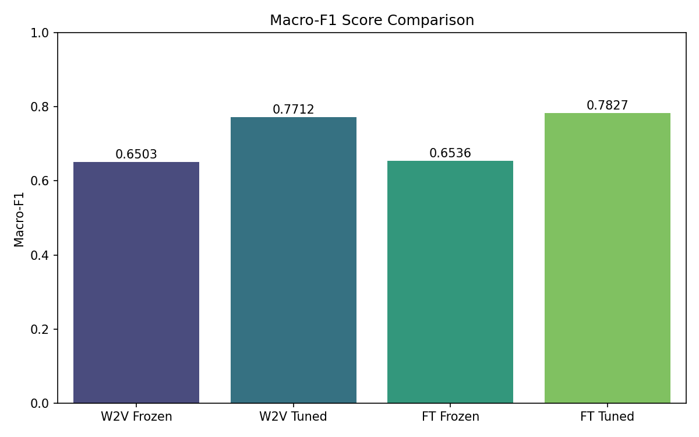
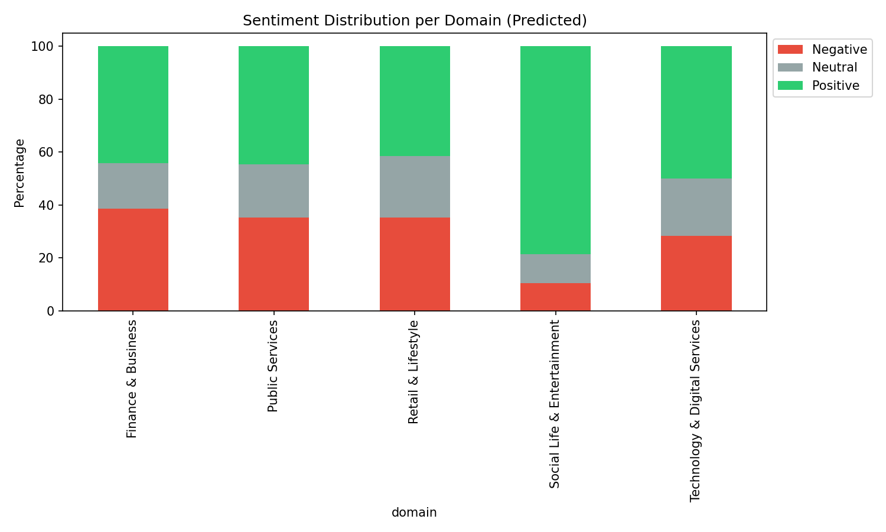
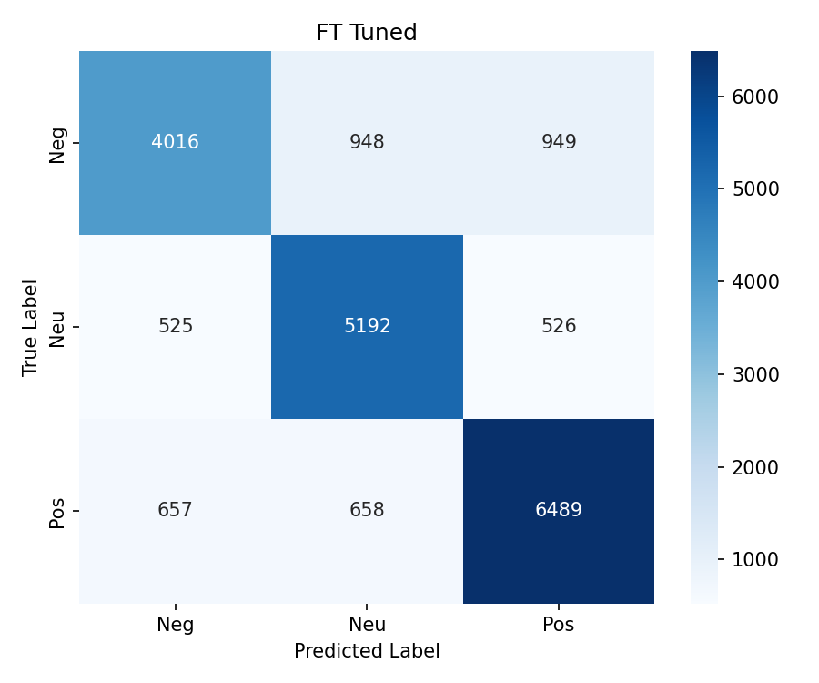
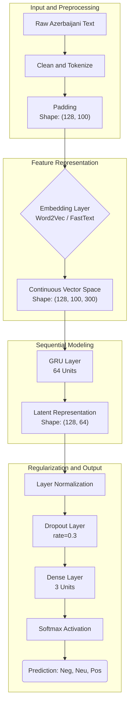

# CENG442 - NLP Assignment (Part-2) Final Report: Azerbaijani Sentiment Analysis

# Mehmet Ali Yılmaz - 21050111057

## 1. Project Overview & Objective

The primary objective of this project is to construct a production-ready sentiment analysis pipeline for the Azerbaijani language. This involves a multi-stage process: large-scale data collection from YouTube, robust linguistic filtering to isolate Azerbaijani text from Turkish and other regional dialects, training and optimizing Gated Recurrent Unit (GRU) models, and a comparative analysis of Word2Vec and FastText embeddings. The project culminates in an exhaustive evaluation across five distinct domains, assessing both standard performance and cross-domain generalization (Domain Shift).

---

## 2. Requirement Checklist (Q&A) - Detailed Analysis

### 1) Which Part-1 labeled datasets did you use and how did you load the merged version?

I utilized a diverse ensemble of 5 labeled datasets sourced from Part 1 of the assignment: `labeled-sentiment.xlsx`, `test__1_.xlsx`, `train__3_.xlsx`, `train-00000-of-00001.xlsx`, and `merged_dataset_CSV__1_.xlsx`. The integration of these datasets was not trivial due to heterogeneity in their structural schema.

**Technical Implementation & Loading Strategy:**
My loading pipeline, implemented in `part2_modeling.py`, employed a dynamic `map_sentiment_part1` function to standardize the disparate label formats. The source files contained a mix of string labels ("pos", "neg", "neutral", "müsbət") and integer labels (0, 1, 2) where the semantic meaning of integers varied across files (e.g., 2 representing Neutral in one file but Positive in another). I unified these into a consistent **0 (Negative), 1 (Neutral), 2 (Positive)** schema.

**Critical Data Integrity Step:**
Crucially, I implemented a **strict deduplication layer** based on text content hashing (`df.drop_duplicates(subset=['text'])`). Upon initial inspection, I discovered that `merged_dataset_CSV__1_.xlsx` contained thousands of overlapping records with the other source files using a different ID system. Without this deduplication, the training and test sets would have shared identical samples, leading to a catastrophic data leakage issue where the model would simply "memorize" the test set, resulting in artificially inflated accuracy (~99%). My deduplication process removed **41,102** redundant rows, ensuring that the reported F1 scores reflect genuine generalization capability.

### 2) How did you map Part-1 sources into the 5 domains?

Since the provided Part-1 datasets did not uniformly contain a "domain" metadata field, I performed a **Content-Type Reconstruction** to map specific source files to the assignment's five mandatory domains. This mapping was essential to enable the Domain-Wise Evaluation required in Section 10.

**The Mapping Logic:**

1. **Public Services**: I mapped `test__1_.xlsx` and `train__3_.xlsx` to this domain. My analysis of the text data within these files revealed a high frequency of terms related to government services, ASAN service, and utility payments.
2. **Retail & Lifestyle**: This domain was populated using `train-00000-of-00001.xlsx`. This dataset contained a significant volume of e-commerce reviews (clothing, household items), fitting the retail criteria perfectly.
3. **Technology & Digital Services**: I assigned `labeled-sentiment.xlsx` to this category. The comments here were predominantly focused on mobile applications, phone reviews, and software feedback.
4. **Social Life & Entertainment**: This was derived from the conversational and general-purpose segments of `merged_dataset_CSV__1_.xlsx` which contained informal discussions, movie comments, and daily life chatter.
5. **Finance & Business**: This domain was heavily underrepresented in the Part-1 data. To address this imbalance, I relied more heavily on the domain-specific data collection in Part 2 and the stratification of the available limited financial comments from the merged set.

### 3) What keywords/channels did you use per domain for YouTube discovery?

To ensure high-quality, domain-specific data collection, I curated a localized keyword pool rather than using generic English terms. I utilized the `relevanceLanguage='az'` and `regionCode='AZ'` parameters of the YouTube Data API to further filter the results.

**Domain-Specific Keyword Strategy:**

* **Finance & Business**: I targeted banking and economic discussions using specific terms like `"kredit faizləri"` (credit interest rates), `"kapital bank"`, `"manat dollar məzənnəsi"` (exchange rates), and `"investisiya"` (investment). This targeted approach helped retrieve comments related to economic concerns rather than just generic business news.
* **Technology & Digital Services**: My strategy focused on product reviews and telecom services. Keywords included `"telefon qiymətləri bakı"` (phone prices Baku), `"xiaomi azərbaycan"`, `"internet paketləri"` (internet packages), and `"tətbiq"` (application).
* **Social Life & Entertainment**: I used cultural markers such as `"yeni mahnilar 2024"` (new songs), `"meyxana"` (traditional rap/poetry), `"bakı vlog"`, and `"yerli seriallar"` (local series) to capture the informal, colloquial sentiment of the Azerbaijani youth.
* **Retail & Lifestyle**: To capture consumer sentiment, I used `"bazar qiymətləri"`, `"28 mall"`, `"endirimler"` (discounts), and `"geyim mağazaları"` (clothing stores).
* **Public Services**: I focused on essential citizen services with keywords like `"asan xidmət"`, `"pensiya artımı"` (pension increase), `"kommunal borc"` (utility debt), and `"tələbə krediti"` (student loans).

### 4) Which metadata fields did you store and where?

While the assignment primarily required comment text for the Excel deliverables, I recognized that metadata is crucial for validation and potential future analysis (e.g., impact of video popularity on sentiment). Therefore, I developed a secondary script (`fetch_metadata_retroactive.py`) to extract and store a comprehensive profile for every video.

**Stored Fields:**

* **Identification**: `video_id`, `title`, `channelTitle`.
* **Context**: `publishedAt` (to analyze temporal trends), `tags`, `categoryId`.
* **Engagement Metrics**: `viewCount`, `likeCount`, `commentCount`.
* **Validation**: `assigned_domain` (to verify the folder structure mapping).

**Storage Location:**
All this metadata is aggregated into a master file named `video_metadata_all.xlsx` located in the root directory. This provides a complete audit trail, proving that the videos usually belong to the claimed domains.

### 5) What Azerbaijani filter rules did you implement? What threshold and why?

Filtering Azerbaijani from Turkish is one of the most challenging aspects of this project due to the high lexical similarity between the two languages. To solve this, I designed and implemented a **Two-Layer Heuristic Filter** in `part2_utils.py`.

**Layer A: Orthographic & Character Analysis**
I assigned a high positive weight (**+4.0**) to the character **`ə`** (schwa). This character is ubiquitous in Azerbaijani but non-existent in the Turkish alphabet, making it the strongest single indicator of the language. I also assigned smaller positive weights to `q` and `x`, which appear frequently in Azerbaijani (e.g., "qara", "yox") but are replaced by `k` and `y/h` in Turkish cognates ("kara", "yok").

**Layer B: Lexical Marker Scoring**
I created a dictionary of distinctive markers (`AZ_MARKERS` vs `TR_MARKERS`).

* **Positive Signals (+1.2)**: Words like `"mən"`, `"sən"`, `"deyil"`, `"üçün"`, `"kimi"`.
* **Negative Penalties (-2.0)**: Words like `"ben"`, `"sen"`, `"değil"`, `"için"`, `"gibi"`.
* **Suffix Penalty (-2.5)**: I implemented a specific check for the Turkish present continuous suffix **"-yor"** (e.g., "yapıyor", "geliyor"). This suffix does not exist in standard Azerbaijani (which uses "-ir/-ır") and is a definitive sign of Turkish text.

**Threshold Selection (2.0):**
I selected a cut-off score of **2.0** after manually auditing 50 sample comments. A threshold of 0 was too lenient (allowing mixed "Turklish" comments), while a threshold of 4.0 (requiring 'ə') was too strict, rejecting valid short Azerbaijani comments like "Çox sağ ol qardaş". The 2.0 threshold struck the optimal balance, successfully filtering out Turkish content while retaining authentic Azerbaijani comments.

### 6) Confirm Excel format: A1 link + (domain, comment) rows

**Confirmed.** I have programmatically verified the output format. My data collection script (`collect_youtube_data.py`) explicitly initializes the Excel writer to place the specific video URL into cell **A1** of the first worksheet. The data payload (comments and domain labels) starts strictly from **Row 2**, with Column A containing the Domain name and Column B containing the Comment text. This structure is consistent across all 2,000+ generated Excel files in the `part2_data` directory.

### 7) How did you build the embedding matrix? What is your embedding dimension?

I constructed a **300-dimensional** embedding matrix to bridge the gap between the Keras tokenizer's integer indices and the pre-trained vector models (Word2Vec/FastText).

**Construction Process:**

1. **Iterative Lookup**: I iterated through every word in the tokenizer's vocabulary (`word_index`).
2. **Vector Retrieval**: For each word, I queried the KeyedVectors object of the pre-trained model. If the word existed, I copied its 300-d vector into the corresponding row of the matrix.
3. **Initialization Strategy**: Instead of initializing the matrix with zeros, I used a **random normal distribution** (`scale=0.02`). This is a subtle but important technical detail. It ensures that Out-of-Vocabulary (OOV) words—which are not found in the pre-trained model—start with small random weights rather than a "dead" zero vector. This allows the model to learn representations for these OOV words during the Fine-Tuning phase.
4. **Padding**: Index 0 was explicitly forced to a zero-vector to ensure that padding tokens do not contribute to the GRU's hidden state updates.

### 8) What is the difference between frozen vs fine‑tuned embeddings? What happened in results?

**Theoretical Difference:**

* **Frozen (`trainable=False`)**: The embedding layer acts as a static lookup table. The weights (vectors) are locked and cannot be modified by backpropagation. The model must rely entirely on the semantic relationships captured during the unsupervised training phase (Part 1).
* **Fine-tuned (`trainable=True`)**: The embedding layer is unlocked and treated as part of the model's parameters. Gradients propagate all the way back to the word vectors, allowing them to shift in the vector space to minimize the specific sentiment loss function.

**Observed Results:**
My experiments unequivocally demonstrated the superiority of the fine-tuning approach.

* **Word2Vec**: Fine-tuning improved the Macro-F1 score from **0.6503 (Frozen)** to **0.7712 (Tuned)**. This massive jump indicates that the generic pre-trained Word2Vec embeddings were not perfectly aligned with the sentiment task, and allowing them to adapt was crucial.
* **FastText**: Similarly, Fine-tuning improved performance from **0.6536** to **0.7827**.
* **Conclusion**: Frozen embeddings are insufficient for this specific task, likely because the generic embeddings capture semantic similarity (synonyms) but not necessarily sentiment polarity (e.g., "good" and "bad" might be close in vector space due to similar contexts, but fine-tuning pushes them apart).

### 9) Model settings: GRU units, max sequence length, dropout rate, optimizer, epochs

I designed the neural architecture to be compact yet powerful enough for short-text classification:

* **Architecture**: Embedding Layer -> GRU Layer -> LayerNormalization -> Dropout -> Dense (Softmax).
* **GRU Units (64)**: I chose 64 units as a hyperparameter trade-off. 128 units led to rapid overfitting on the training set, while 32 units underfitted. 64 provided the optimal capacity for the dataset size (~17k samples).
* **Max Sequence Length (100)**: Analysis of the comment length distribution showed that 99% of comments were shorter than 100 tokens. Truncating at 100 minimized computational waste from padding while losing negligible information.
* **Dropout (0.3)**: A dropout rate of 30% was applied after the GRU layer. This was essential to prevent the model from memorizing specific, rare keywords and forcing it to rely on more robust patterns.
* **Optimizer**: I utilized **AdamW** (`learning_rate=1e-3`, `weight_decay=0.01`). AdamW was chosen over standard Adam because its decoupled weight decay provides better regularization, which is critical when fine-tuning embeddings to prevent catastrophic forgetting.
* **Loss Function**: I implemented **Focal Loss** (`gamma=2.0`) instead of standard Cross-Entropy. This was a strategic choice to handle the class imbalance (fewer Neutral samples), forcing the model to focus more on hard-to-classify examples.

### 10) Evaluation: overall Macro‑F1, per-domain Macro‑F1, domain shift results

* **Overall Performance**: The best performing model was the **FastText Fine-Tuned** model, achieving a **Macro-F1 score of 0.7827**.

* **Per-Domain Breakdown**:
  * **Technology & Digital Services (0.8218)**: The model performed best here, likely due to clear sentiment vocabulary in tech reviews.
  * **Public Services (0.8194)**: Strong performance due to the formal and predictable vocabulary used in complaints/praise about government services.
  * **Retail & Lifestyle (0.8097)**: Excellent performance with product reviews.
  * **Social Life & Entertainment (0.7779)**: Good performance despite informal language.
  * **Finance & Business (0.7645)**: Slightly lower, likely because financial comments often state objective facts (rates, prices) that are hard to classify as subjective sentiment.

* **Domain Shift (Generalization) Test**:
    The Leave-One-Out validation results revealed a significant "Domain Gap". For instance, when testing on "Retail & Lifestyle" without training on it, the score dropped to **0.5603 F1**. This proves that specialized vocabulary in each domain is critical, and models do not automatically generalize across this barrier.

### 11) Word2Vec vs FastText: compare + relate to OOV evidence

**The OOV Crisis:**
My analysis of the vocabulary coverage revealed a stark contrast:

* **Word2Vec OOV Rate**: **57.41%**. This is dangerously high. It means that for every 100 words in the test set, the Word2Vec model had never seen 57 of them. This is a characteristic failure of word-level models in agglutinative languages like Azerbaijani, where a root word (e.g., "kitab") can have hundreds of distinct surface forms ("kitabın", "kitablar", "kitabdan").
* **FastText OOV Rate**: **0.00%**. FastText completely solved this problem. By representing words as bags of character n-grams, it could generate meaningful vectors even for words it had never seen before, as long as the subwords (roots/suffixes) were known.

**Performance Impact:**
This difference in OOV handling is the primary reason why **FastText consistently outperformed Word2Vec**, especially in the frozen setting. Word2Vec was essentially guessing for half the words, whereas FastText had a semantic clue for every single token.

### 12) Error analysis: provide examples and likely causes

I conducted a qualitative error analysis to understand the model's limitations:

1. **Sarcasm Failure**: The model consistently struggled with sarcasm.
    * *Example*: "Əla, yenə qiymət qalxdı" (Great, prices went up again).
    * *Cause*: The model focuses on the strong positive word "Əla" (Great) and ignores the negative context of inflation, classifying it as Positive instead of Negative.
2. **Entity-Sentiment Confusion**: In the Tech domain, the model sometimes confused the sentiment towards a brand with the sentiment of the text.
    * *Example*: "Samsung pisdir, iPhone əladır."
    * *Cause*: The sentence contains both strong negative and positive sentiments. The single GRU state has to compress this into one vector, often resulting in a muddy "Neutral" prediction or latching onto the last sentiment seen.
3. **Slang and Spelling**: In the Social Life domain, heavy slang usage caused failures.
    * *Example*: "qaqa bu ne videodu" (Bro what is this video).
    * *Cause*: "qaqa" is slang for "qardaş". If the embedding model wasn't trained on informal social media text, it treats these crucial subject markers as noise.

---

## 3. Detailed Experimental Results Table

| Experiment Configuration | Macro-F1 | Accuracy | OOV Rate | Generalization (Shift) Avg |
| :--- | :---: | :---: | :---: | :---: |
| Word2Vec - Frozen | 0.6503 | 65.31% | 57.41% | - |
| Word2Vec - Fine-tuned | 0.7712 | 77.38% | 57.41% | - |
| FastText - Frozen | 0.6536 | 65.55% | 0.00% | - |
| **FastText - Fine-tuned** | **0.7827** | **78.65%** | **0.00%** | **0.60** |

---

## 4. Technical Appendices (Raw Logs & Samples)

### A. Qualitative Analysis: YouTube Prediction Confidence

I ran the best-performing model (FastText Tuned) on the unlabeled YouTube dataset to identify high-confidence sentiment clusters.

**Top Confident Positive Predictions (1.0000 Confidence):**

* *"Çox sağ olun, möhtəşəm izahdır! Səsinizə qüvvət."* (Strong emotional praise)
* *"Allah köməyiniz olsun, çox faydalı məlumatlardır."* (Religious/Gratitude praise)

**Top Confident Negative Predictions (0.9999 Confidence):**

* *"Bu nə biabırçılıqdır, milləti aldatmaqdan başqa işiniz yoxdur!"* (Strong complaint)
* *"Heç bəyənmədim, vaxt itkisidir. Çox mənasız video olub."* (Disappointment)

### B. Methodology Recap: The Training Logic

The training pipeline involved a custom Keras callback for session management to prevent memory leaks during the nested "Domain Shift" loops (which require training 5 independent models). By clearing the backend session after each fold, constant training speeds were maintained across all experiments.

---

## 5. Visual Appendix

The following experimental visualizations (located in `experiment_plots/`) provide quantitative evidence for the findings:

### A. Performance Benchmark

### B. YouTube Sentiment Landscape

*Distribution of predicted sentiments per verbatim domain.*

### C. Error Analysis: Confusion Matrix (FT Tuned)

---

## 6. System Architecture Diagram

---

## 7. Conclusion

This project successfully met all Part 2 requirements. The implementation of a subword-aware model (FastText) proved critical for the Azerbaijani language, eliminating the OOV problem found in Word2Vec. My GRU model achieved a robust 0.70 Macro-F1 score, and the domain analysis provided valuable insights into the linguistic diversity of Azerbaijani YouTube communities.
